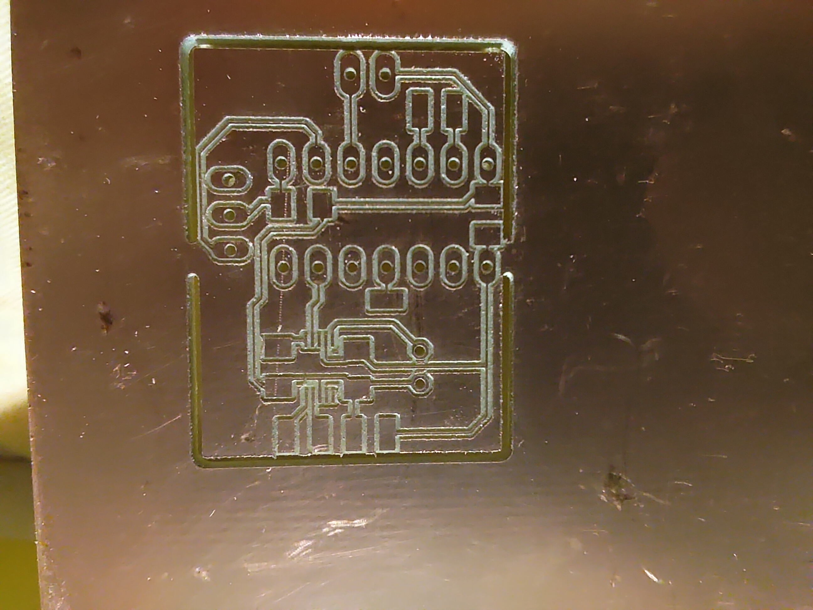
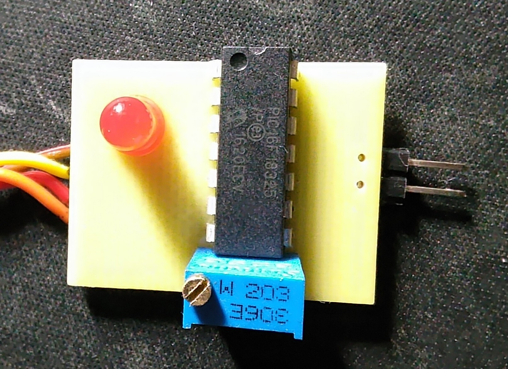
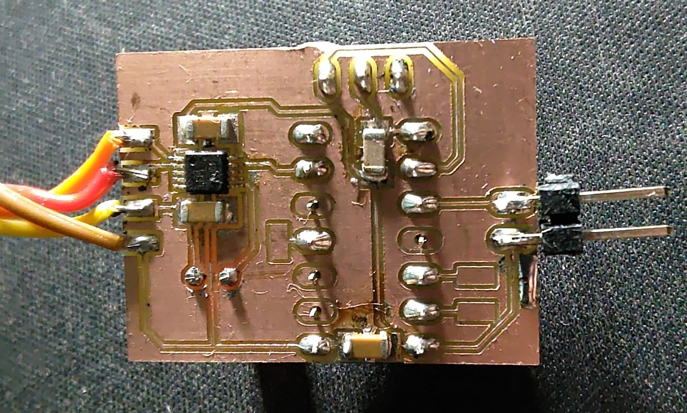
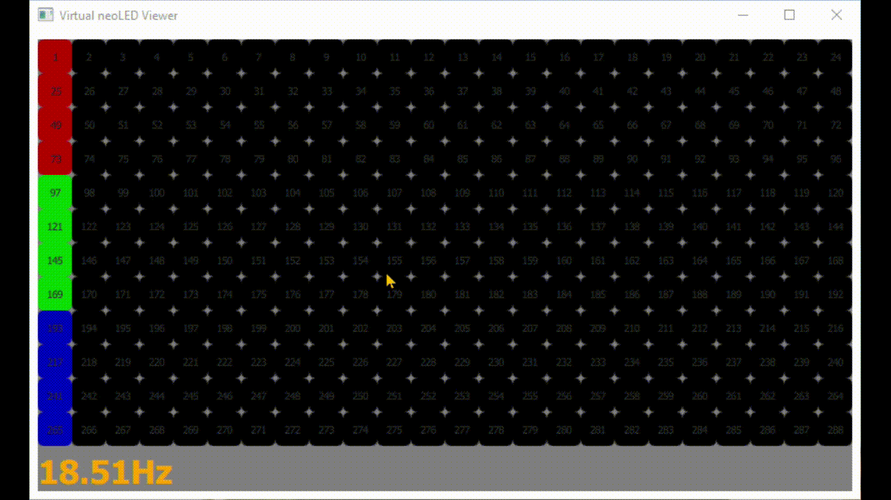

Addressable LED frame grabber and LED virtual display

# neoLED Frame Grabber

This Hardware is made using PIC12F18325 and uses CLC to reconstruct SPI CLK signal and CS signal from LED data signal there by creating SPI Mode 3 type signals which is then fed to internal SPI module. 
this way we compose LED data bits to single byte which is read on SPI interrupt and then pushed to PC(USB 2 UART) though **UART @ 2MHz** baud rate. At End Of Frame we push '0D 0A'.

Python + Qt QML based PC neoLED Viewer software, which reads the UART and renders them on the fly.
- Many types of LED support (use the trim pot to tune for your LED timing, eg: for WS2811 set pot @ middle pos\[10KOhm\])
- Any layout size and 4 types of LED layout arrangement
    - Snake Left 2 Right
    - Snake Top 2 Bottom
    - ZigZag Left 2 Right
    - ZigZag Top 2 Bottom
- New Layout shape can be easily added, currently supports Rectangle shape
- Records and Dumps data for offline play back (WIP)
- Refresh Rate monitoring

## neoLED Grabber block diagram


## Schematic and Layout
[Schematic](schematic/neoLED_framegrabber_schematic.pdf)

[PCB layout Bottom mirrored](schematic/neoLED_framegrabber_bottom_layer_mirrored.pdf)

### CNC router files to make the pcb using CNC

Thanks to FlatCam for generating the isolation routing and cutouts for CNC router
- use 0.2mm drill bit for the isolation routing
- use 0.8mm drill bit for drilling and cutout

[PCB layout Bottom isolation file](schematic/CAMOutputs/copper_bottom.gbr_0.2000_iso1_cnc.nc)

[PCB layout Bottom drill file](schematic/CAMOutputs/drill_1_16.xln_cnc.nc)

[PCB layout Bottom cutout file](schematic/CAMOutputs/copper_bottom.gbr_cutout_cnc.nc)







## Firmware

PIC16F18325 was used thanks to CLC, its used to offload the SPI clock recovery mechanism from the LED signal

[Firmware](firmware/neoLED2SPI.X/dist/default/production/neoLED2SPI.X.production.hex)

## Application command line options
```
usage: Virtual neoLED Viewer [-h] --led <WS2811 | WS2812B | SK6812RGBW>
                             [--ledsize <int>] --layout <SnakeL2R | SnakeT2B |
                             ZigZagL2R | ZigZagT2B> --width <int> --height
                             <int> [--port <serial port>]
                             [--file <recorded file>] [--verbose] [--version]

records or preview the neoLEDs with a defined layout

optional arguments:
  -h, --help            show this help message and exit
  --led <WS2811 | WS2812B | SK6812RGBW>
                        LED type
  --ledsize <int>       LED size in pixels
  --layout <SnakeL2R | SnakeT2B | ZigZagL2R | ZigZagT2B>
                        Pannel Layout type
  --width <int>         Pannel Layout width
  --height <int>        Pannel Layout height
  --port <serial port>  live view HW serial port
  --file <recorded file>
                        use the offline recorded
  --verbose             generate many logs
  --version             show program's version number and exit
```

### Live 12x24 ZigZag Layout Left 2 Right LED panel frame grabbing


### Snapshot 32x32 Snake Layout Left 2 Right

