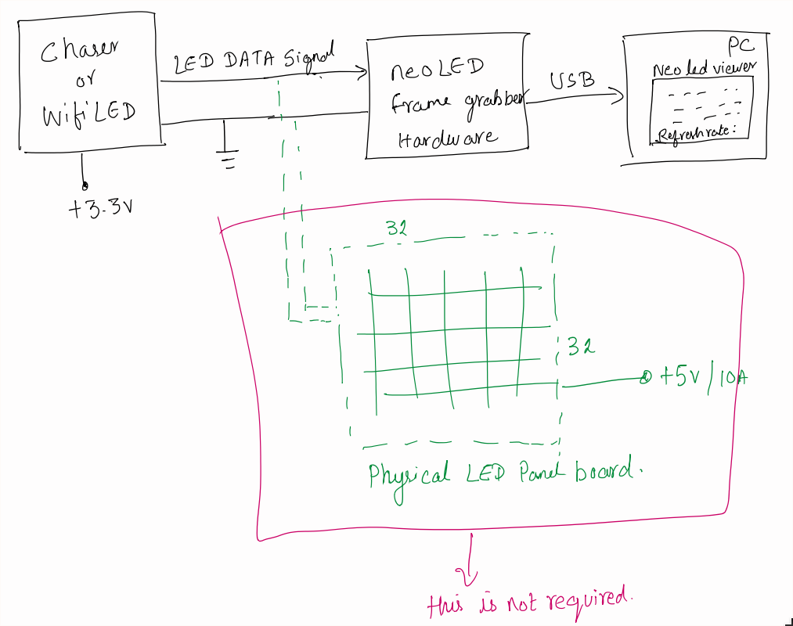
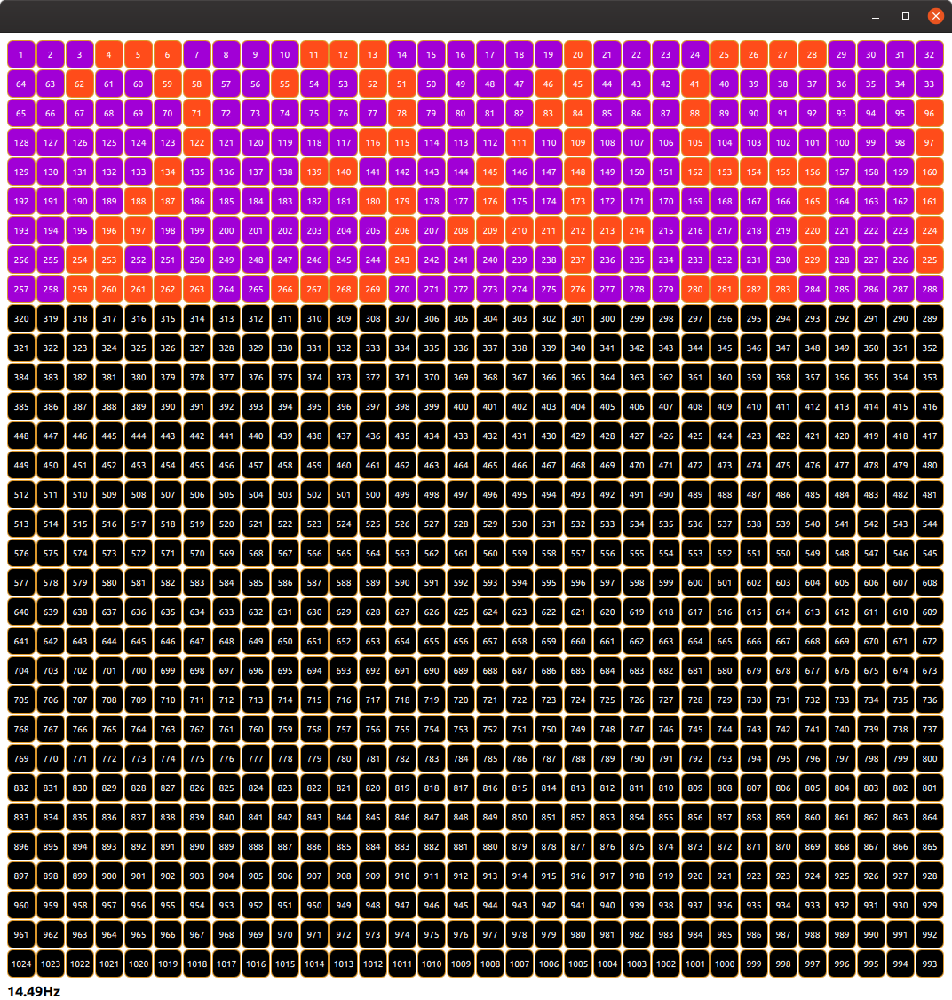

Addressable LED frame grabber and LED virtual display

# neoLED Frame Grabber

This Hardware is made using PIC12F18325 and uses CLC to reconstruct SPI CLK signal and CS signal from LED data signal there by creating SPI Mode 3 type signals which is then fed to internal SPI module. 
this way we compose LED data bits to single byte which is read on SPI interrupt and then pushed to PC(USB 2 UART) though **UART @ 2MHz** baud rate. At End Of Frame we push '0D 0A'.

### neoLED Grabber block diagram


[Schematic](schematic/neoLED2SPI.PDF)

Python + Qt QML based PC neoLED Viewer software, which reads the UART and renders them on the fly.
- Many types of LED support
- Any layout size and 4 types of LED layout arrangement
    - Snake Left 2 Right
    - Snake Top 2 Bottom
    - ZigZag Left 2 Right
    - ZigZag Top 2 Bottom
- New Layout shape can be easily added, currently supports Rectangle shape
- Records and Dumps data for offline play back (WIP)
- Refresh Rate monitoring

### command line options
```
usage: Virtual neoLED Viewer [-h] --led <WS2811 | WS2812B | SK6812RGBW>
                             [--ledsize <int>] --layout <SnakeL2R | SnakeT2B |
                             ZigZagL2R | ZigZagT2B> --width <int> --height
                             <int> [--port <serial port>]
                             [--file <recorded file>] [--verbose] [--version]

records or preview the neoLEDs with a defined layout

optional arguments:
  -h, --help            show this help message and exit
  --led <WS2811 | WS2812B | SK6812RGBW>
                        LED type
  --ledsize <int>       LED size in pixels
  --layout <SnakeL2R | SnakeT2B | ZigZagL2R | ZigZagT2B>
                        Pannel Layout type
  --width <int>         Pannel Layout width
  --height <int>        Pannel Layout height
  --port <serial port>  live view HW serial port
  --file <recorded file>
                        use the offline recorded
  --verbose             generate many logs
  --version             show program's version number and exit
```

### Software Picture 32x32 Snake Layout Left 2 Right

